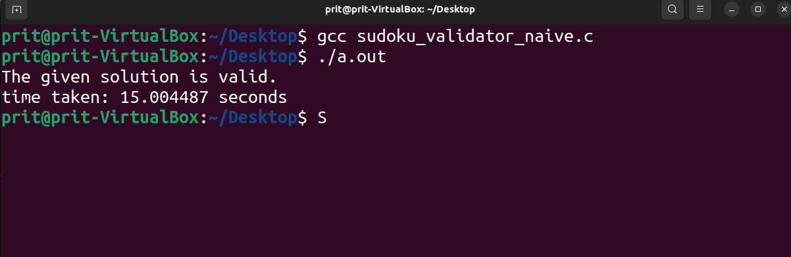
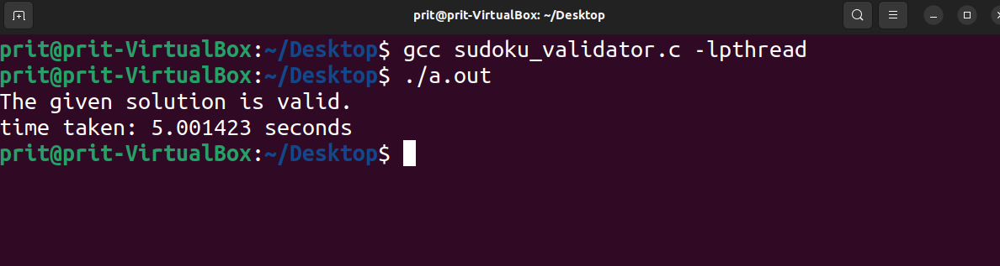

# Sudoku-Solution-Validator

## Aim

A Sudoku puzzle uses a 9 × 9 grid in which each column and row, as well as
each of the nine 3 × 3 subgrids, must contain all of the digits 1 · · · 9.

This project consists of designing a multithreaded application that determines whether the solution to a Sudoku puzzle is valid or not.

## Theory

A thread is a basic unit of CPU utilization. It comprises a thread ID, a program counter, a register set, and a stack. It shares with other threads belonging to the same process its code section, data section, and other operating-system resources, such as open files and signals.

## Implementation

### Naive Implementation

```sudoku_validator_naive.c``` is a naive implementation of the sudoku validator. Here we check all 3 conditions for valid sudoku serially. 
### Multithreaded Implementation

```sudoku_validator.c``` creates 3 threads for checking each condition parallelly. It makes use of the Pthreads library which is a POSIX standard defining an API for thread creation and synchronization supported by UNIX and several other operating systems.

## Results

To see the results visibly, we use the ```sleep()``` function defined in ```unistd.h```. After checking each condition, we pause the execution of the program for 5 seconds. 

### Naive implementation



Since the program is running serially and each function sleeps for 5 seconds, the execution time is about 15 seconds.

### Multithreaded implementation



Since the conditions are running parallel to each other and each function sleeps for 5 seconds, the execution time is about 5 seconds only.